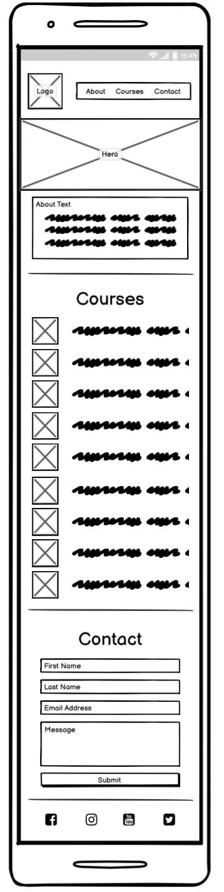
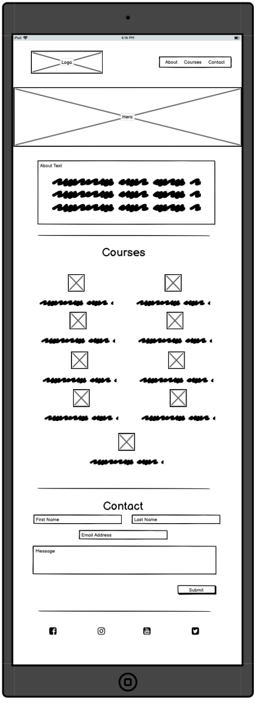
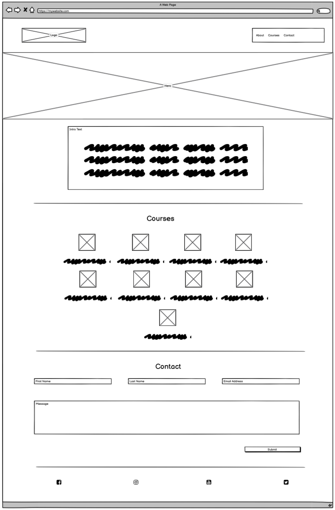
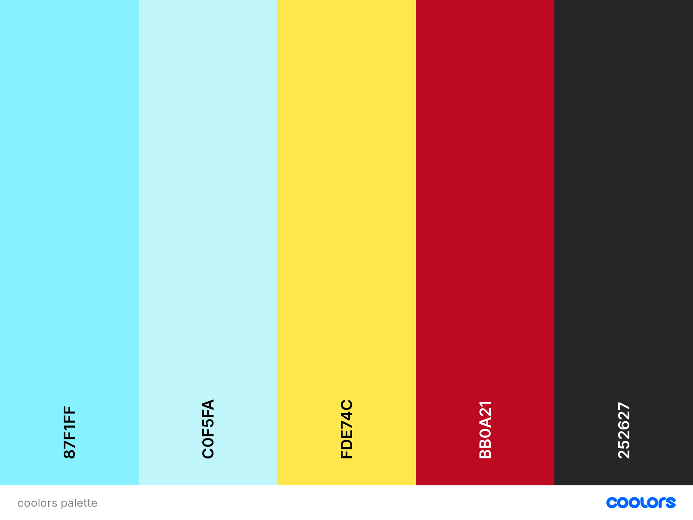

# Love Running

In this section, you will include one or two paragraphs providing an overview of your project. Essentially, this part is your sales pitch. At this stage, you should have a name for your project so use it! Don’t introduce the project as a Portfolio project for the diploma. In this section, describe what the project hopes to accomplish, who it is intended to target and how it will be useful to the target audience. 

For example; Love Running is a site that hopes to help keep people motivated to meet up for runs on a regular basis in Dublin, Ireland. The site will be targeted toward runners who are looking for a way to socialise and keep themselves fit. Love Running will be useful for runners to see exactly when and where they should be to join the running club. 

## User Stories

# Potential Students

As a potential student, I want to quickly see what courses are offered so I can see if they are of interest.

As a potential student, I want to see some general information about the college so I can find out a bit bout it.

As a potential student, I want to be able to contact the college so that I can ask any questions I have about the college.

ADD ACCEPTANCE CRITERIA'S?? WATCH https://us02web.zoom.us/rec/play/9FIKllHX2ZiQNFRhYPn_hBh_ZeA8964ZvIDLnhpKGAf1NLVc3_hBJ6zSL8Hv5Hx7ALnPtDmbg8CmFAs.YVsZ9LR_uI7OjEwH

GIVE HAPPY PATH (when user does as expected), and SAD PATH (if put in incorecct info etc and user gets alerted)

TECHNICAL IMPLEMENTATION (how will implement feature, eg, a form will be added with x, x and x required, email must be email etc. user alerted if incoreect input)

## Features 

In this section, you should go over the different parts of your project, and describe each in a sentence or so. You will need to explain what value each of the features provides for the user, focusing on who this website is for, what it is that they want to achieve and how your project is the best way to help them achieve these things.

### Existing Features

- __Navigation Bar__

	- The navigation bar allows the user to easily select which area of the site they wish to view.  It will be located at the top of the site as this is common practice and is the area where most users eyes will be initially drawn to.  It will be 'sticky', meaning it will stay at the top of the users screen even when they scroll the site.  This is because the site is a one page design and it is essential for the user to always be able to navigate the site wherever their current position.  When a link is hovered over it becomes underlined to help the user confirm they are about to select the releavnt link.

The 'hamburger' icon was not used on small screens (where the navigation bar will collapse and be represented as three horizontal lines.  When touched/clicked, this would reveal the navigation in a dropdown menu).    This is often done due to the limited real estate space making the text hard to read when the screen is this size.  However, this design was not used to make the site more easy to navigate for all users.  Furthermore the navigation only contains THREE?? links so they have the space to remain next to each other still on small screens without causing accessibility and design issues.

ADD IMAGE INFORMATION

Information Box
A small box containing introductory information is placed below the image.  This is eye-catching and quickly confirms to the user that they are on the correct site.  It offers general information on the college so users quickly get a feel for the college.

- __Our Courses Section__

This section lists the courses available at the college so users can quickly see if they offer a course they are interested in.  Icons from Font Awesome are used for the courses to add visual interest and to make each course quickly identifiable and more memorable.

- __Contact Section__

This section allows the user to easily contact the college by using a form to send a message.  The fields are clearly marked, all required and the email field must contain a valid email.  The Submit button is a bright distinctive colour, acting as a call to action for the user.

- __Footer__

The footer feature at the bottom of the page contains links to Hull College's social media links.  This will help users find more information.  The links open in a new tab so users are not taken away from Hull College's website.

ADD IMAGES FOR FEATURES.

For some/all of your features, you may choose to reference the specific project files that implement them.

In addition, you may also use this section to discuss plans for additional features to be implemented in the future:

### Design

## Wireframes

# Small
<<<<<<< HEAD

# Medium

# Large

=======

# Medium

# Large

>>>>>>> 784635ef5b11571cb3b102e4dd5c5b8aac69ca39

## Colour Pallate

Blue was chosen as the main colour for the site.  Research had shown that this is a colour associated with reliability, productivity, trust and order, which are the principles the college wish to promote. 

Coolors.co was then used to find a complementray colour platette, with the following decided upon:

## Fonts
Typespiration.com was used to find complimenting Google Font pairings, with the following decided upon:

Headings: Open Sans, with a fallback of Sans-serif. 
Body: Crimson, with a fallback of Serif.

ADD IMG??

### Issues and Bugs
TEXTAREA PLACEHOLDER TEXT NOT SHOWING
research showed opening and closing element must be on same line
add img?

USED INCORRECT QUOTATION MARKS FOR PLACEHOLDERS
add img??

CHANGING COMMIT MESSAGE??

BACKGROUND COLOUR NOT SHOWING BECAUSE I HADN'T ADDED A HEIGHT TO HEADER

SMALL GAP BELOW IMAGES. SET TO INLINE: BLOCK

### Features Left to Implement

- Another feature idea

## Testing 

In this section, you need to convince the assessor that you have conducted enough testing to legitimately believe that the site works well. Essentially, in this part you will want to go over all of your project’s features and ensure that they all work as intended, with the project providing an easy and straightforward way for the users to achieve their goals.

In addition, you should mention in this section how your project looks and works on different browsers and screen sizes.

You should also mention in this section any interesting bugs or problems you discovered during your testing, even if you haven't addressed them yet.

If this section grows too long, you may want to split it off into a separate file and link to it from here.

IF HAD TIME:
If site got more involved features would have done:
  unit testing, system testing and regression testing

### Validator Testing 

- HTML
  - No errors were returned when passing through the official [W3C validator](https://validator.w3.org/nu/?doc=https%3A%2F%2Fcode-institute-org.github.io%2Flove-running-2.0%2Findex.html)
- CSS
  - No errors were found when passing through the official [(Jigsaw) validator](https://jigsaw.w3.org/css-validator/validator?uri=https%3A%2F%2Fvalidator.w3.org%2Fnu%2F%3Fdoc%3Dhttps%253A%252F%252Fcode-institute-org.github.io%252Flove-running-2.0%252Findex.html&profile=css3svg&usermedium=all&warning=1&vextwarning=&lang=en#css)

### Unfixed Bugs

You will need to mention unfixed bugs and why they were not fixed. This section should include shortcomings of the frameworks or technologies used. Although time can be a big variable to consider, paucity of time and difficulty understanding implementation is not a valid reason to leave bugs unfixed. 

## Deployment

This section should describe the process you went through to deploy the project to a hosting platform (e.g. GitHub) 

- The site was deployed to GitHub pages. The steps to deploy are as follows: 
  - In the GitHub repository, navigate to the Settings tab 
  - From the source section drop-down menu, select the Master Branch
  - Once the master branch has been selected, the page will be automatically refreshed with a detailed ribbon display to indicate the successful deployment. 

The live link can be found here - https://code-institute-org.github.io/love-running-2.0/index.html 

## Credits 

https://neilpatel.com/blog/psychology-of-color-and-conversions/

https://smallbiztrends.com/2014/06/psychology-of-colors.html

https://coolors.co/

https://typespiration.com/design/the-buried-city/

https://www.freelogodesign.org/

https://www.educative.io/edpresso/how-to-change-a-git-commit-message-after-a-push   ADD THIS TO BUGS AS WELL? CHANGED COMMINT MESSAGE AS NOT STARTING WITH A CAPITAL

https://www.remove.bg/

In this section you need to reference where you got your content, media and extra help from. It is common practice to use code from other repositories and tutorials, however, it is important to be very specific about these sources to avoid plagiarism. 

You can break the credits section up into Content and Media, depending on what you have included in your project. 

### Content 

- The text for the Home page was taken from Wikipedia Article A
- Instructions on how to implement form validation on the Sign Up page was taken from [Specific YouTube Tutorial](https://www.youtube.com/)
- The icons in the footer were taken from [Font Awesome](https://fontawesome.com/)

https://www.remove.bg/

### Media

<!-- ///////////////////////// ME  ///////////////////////// -->

https://stock.adobe.com/

https://www.freevector.com/reward-icons-vector-21370#

<!-- ///////////////////////// NOT ME  ///////////////////////// -->

- The photos used on the home and sign up page are from This Open Source site
- The images used for the gallery page were taken from this other open source site

Congratulations on completing your Readme, you have made another big stride in the direction of being a developer! 

## Other General Project Advice

Below you will find a couple of extra tips that may be helpful when completing your project. Remember that each of these projects will become part of your final portfolio so it’s important to allow enough time to showcase your best work! 

- One of the most basic elements of keeping a healthy commit history is with the commit message. When getting started with your project, read through [this article](https://chris.beams.io/posts/git-commit/) by Chris Beams on How to Write  a Git Commit Message 
  - Make sure to keep the messages in the imperative mood 

- When naming the files in your project directory, make sure to consider meaningful naming of files, point to specific names and sections of content.
  - For example, instead of naming an image used ‘image1.png’ consider naming it ‘landing_page_img.png’. This will ensure that there are clear file paths kept. 

- Do some extra research on good and bad coding practices, there are a handful of useful articles to read, consider reviewing the following list when getting started:
  - [Writing Your Best Code](https://learn.shayhowe.com/html-css/writing-your-best-code/)
  - [HTML & CSS Coding Best Practices](https://medium.com/@inceptiondj.info/html-css-coding-best-practice-fadb9870a00f)
  - [Google HTML/CSS Style Guide](https://google.github.io/styleguide/htmlcssguide.html#General)

Getting started with your Portfolio Projects can be daunting, planning your project can make it a lot easier to tackle, take small steps to reach the final outcome and enjoy the process! 